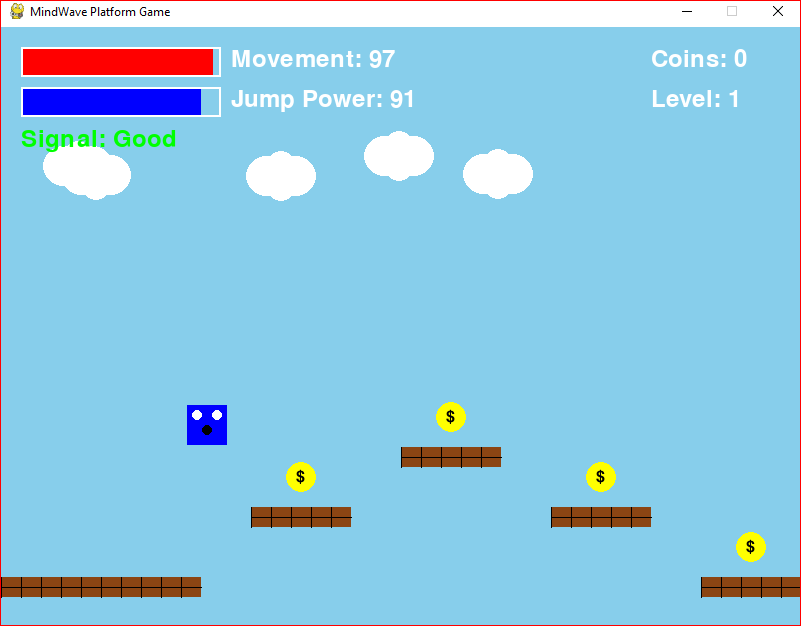
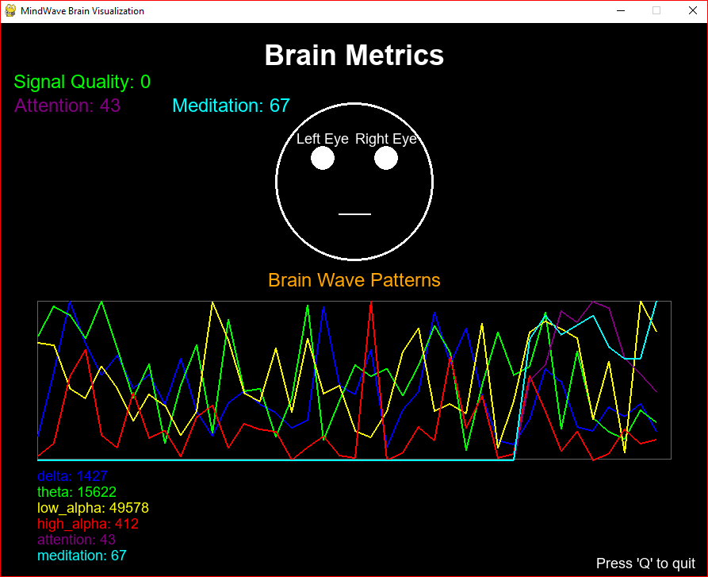
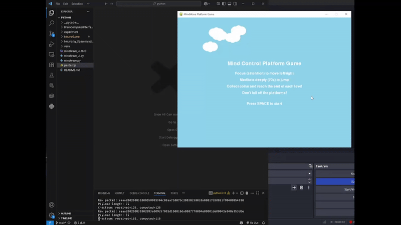
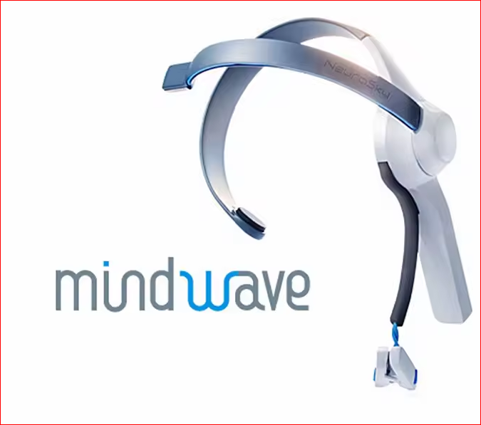
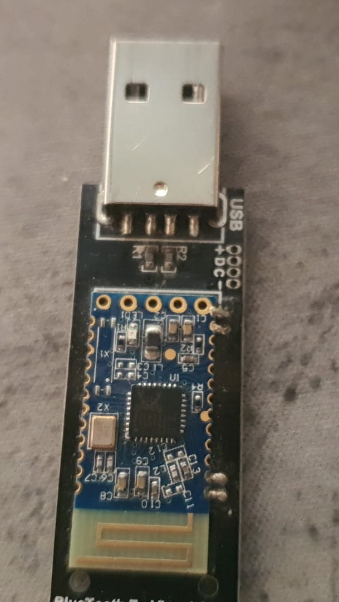

# MindWave EEG Brain-Computer Interface

A Python-based Brain-Computer Interface (BCI) project that uses the MindWave EEG headset to create interactive applications controlled by brainwave signals. This project demonstrates real-time processing of attention, meditation, and various EEG frequency bands to control games and visualize brain activity.

## Features

### Brain-Controlled Gaming
- **Attention-Based Movement**: Control horizontal movement using attention levels
- **Meditation-Based Jumping**: Jump by achieving high meditation states
- **Real-time EEG Processing**: Live brainwave signal processing for responsive gameplay
- **Visual Feedback**: Character expressions change based on brain state

### Real-time Brain Visualization
- **Live EEG Monitoring**: Real-time display of brainwave data
- **Multiple Frequency Bands**: Delta, Theta, Alpha, Beta, and Gamma wave visualization
- **Attention & Meditation Tracking**: Dedicated meters for mental states
- **Blink Detection**: Left/right eye blink detection and classification

## Screenshots

### Brain-Controlled Game


*Control the character using your attention and meditation levels*

### Brain Activity Visualization


*Real-time visualization of EEG signals and brain states*

### Demo in Action


*See the brain-computer interface in action*

## Getting Started

### Prerequisites

- **Hardware**: MindWave EEG headset (NeuroSky)
- **Python**: 3.7+ 
- **Operating System**: Windows, macOS, or Linux

### Hardware Used
- **EEG mindwave headset**: NeuroSky MindWave Mobile EEG Headset 
<br/>
Product Link: [MindWave Mobile](https://nl.aliexpress.com/item/1005006620561995.html)
<br/>


- **Bluetooth to Visual COM**: Bluetooth USB Dongle Adapter Serial Port Transparent Transmission HM-15 Beacon Base Station EDR 4.0+ BLE4.0 Dual Mode Master-Slave in One<br/>


### Required Python Packages

```bash
python -m venv venv
source venv/bin/activate  # On Windows use `venv\Scripts\activate`

pip install pygame pyserial
```

### Hardware Setup

1. **Connect MindWave Headset**: 
   - Pair your MindWave device via Bluetooth
   - Note the COM port (Windows) or device path (Linux/macOS)

2. **Configure Serial Port**:
   - Update the `SERIAL_PORT` variable in both files to match your device
   - Default is set to `"COM9"` - change as needed

## 🎮 Usage

### Running the Brain-Controlled Game

```bash
python game_mindwave.py
```

**Controls:**
- **Attention**: Controls forward and backward movement (0-100 scale)
- **Meditation**: Enables jumping when levels are high enough
- **Goal**: Collect coins while navigating platforms using only your mind!

### Running the Brain Visualization Tool

```bash
python mindwave_ui.py
```

**Features:**
- Real-time EEG frequency band display
- Attention and meditation level meters
- Raw signal visualization
- Blink detection indicators
- Signal quality monitoring

## Configuration

### Serial Port Configuration
Both applications require setting the correct serial port:

```python
# In game_mindwave.py and mindwave_ui.py
SERIAL_PORT = "COM9"  # Windows
# SERIAL_PORT = "/dev/ttyUSB0"  # Linux
# SERIAL_PORT = "/dev/cu.MindWaveMobile-SerialPo"  # macOS
```

### Game Sensitivity Settings
Adjust brain signal sensitivity in `game_mindwave.py`:

```python
# Attention sensitivity for movement
ATTENTION_THRESHOLD = 50

# Meditation threshold for jumping
MEDITATION_THRESHOLD = 60
```

## Technical Details

### EEG Signal Processing
- **Sampling Rate**: 512 Hz (MindWave native)
- **Frequency Bands Monitored**:
  - Delta (0.5-4 Hz): Deep sleep, unconscious processes
  - Theta (4-8 Hz): Drowsiness, meditation
  - Alpha (8-13 Hz): Relaxed awareness
  - Beta (13-30 Hz): Active concentration
  - Gamma (30-100 Hz): High-level cognitive processing

### Data Communication
- **Protocol**: Serial communication via Bluetooth/USB
- **Baud Rate**: 9600
- **Packet Format**: MindWave ThinkGear protocol
- **Real-time Processing**: Sub-100ms latency for responsive control

### Game Mechanics
- **Physics Engine**: Custom pygame-based physics
- **Collision Detection**: Rectangle-based collision system
- **Scoring System**: Coin collection with brain-state feedback
- **Visual Feedback**: Character expressions reflect mental state

## Applications & Use Cases

### Educational
- **Neuroscience Learning**: Understand brainwave patterns
- **BCI Research**: Experiment with brain-computer interfaces
- **Biofeedback Training**: Learn to control attention and meditation

### Therapeutic
- **ADHD Training**: Attention regulation exercises
- **Meditation Practice**: Meditation state visualization
- **Stress Management**: Real-time stress level monitoring

### Gaming & Entertainment
- **Novel Gaming Experiences**: Mind-controlled gameplay
- **Accessibility**: Alternative input method for disabled users
- **Competitive Training**: Mental state optimization for esports

## Research Applications

This project can serve as a foundation for:
- **Cognitive Load Assessment**: Measuring mental workload in real-time
- **Attention Training Systems**: ADHD and focus improvement applications
- **Brain-Computer Interface Research**: Academic BCI studies
- **Neurofeedback Systems**: Clinical biofeedback applications

## Troubleshooting

### Common Issues

**Device Not Connecting:**
- Verify Bluetooth pairing
- Check COM port assignment
- Ensure MindWave is charged and powered on

**Poor Signal Quality:**
- Clean electrode contacts
- Ensure proper headset positioning
- Check for electromagnetic interference

**Game Not Responding:**
- Verify attention/meditation thresholds
- Check serial port configuration
- Ensure headset is properly calibrated

## Future Enhancements

- [ ] **Machine Learning Integration**: Personalized brain pattern recognition
- [ ] **Multi-user Support**: Collaborative brain-controlled experiences
- [ ] **Advanced Games**: More complex BCI-controlled game mechanics
- [ ] **Data Analytics**: Historical brain state analysis and reporting
- [ ] **Mobile App**: Smartphone companion for remote monitoring
- [ ] **Cloud Integration**: Data synchronization and sharing


## License
This project is open source and available under the [MIT License](LICENSE).

## Acknowledgments

- **NeuroSky**: For the MindWave EEG technology
- **Pygame Community**: For the game development framework
- **PySerial Contributors**: For serial communication capabilities

## Contributing
We welcome contributions to enhance this project! Please fork the repository, make your changes, and submit a pull request.

---

*Experience the future of human-computer interaction through the power of your mind!*

